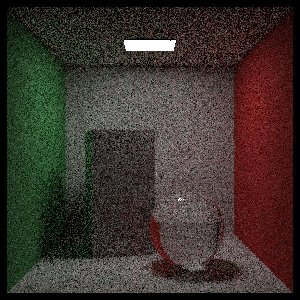
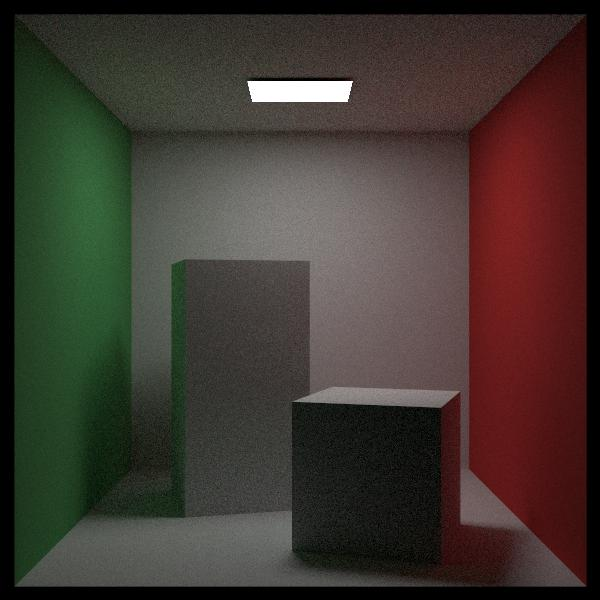
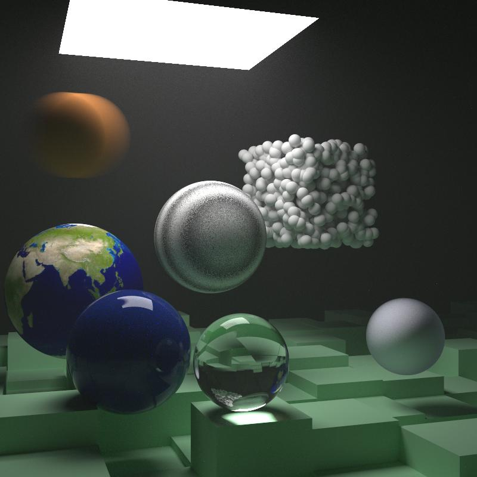

# Go Raytracer
This is a Monte Carlo based path/ray tracer built in Go.
It is largely based on the work of Peter Shirley in his fantastic three path book series
["Ray Tracing in One Weekend"](https://raytracing.github.io/books/RayTracingInOneWeekend.html), ["Ray Tracing: The Next Week"](https://raytracing.github.io/books/RayTracingTheNextWeek.html), and ["Ray Tracing: The Rest of Your Life"](https://raytracing.github.io/books/RayTracingTheRestOfYourLife.html) with some additional features and optimizations added.

## Features
* Supports multiple shape primitives (quads, spheres, triangles) which can be combined to form complex scenes.
* Implements a simple camera model with adjustable focal length and aperture.
* Includes a simple material system with support for Lambertian, Metal, and Dielectric, and Isotropic materials.
* Implements an obj file loader with material support.

## Usage
### Installation
To get a basic scene up and running follow these steps:
1. Clone the repository: `git clone https://github.com/nsp5488/go_raytracer`
2. Navigate to the project directory: `cd go-raytracer`
3. Install dependencies: `go mod tidy`
4. Build the project: `go build`
5. Run the raytracer: `./go-raytracer -S=1`

Where -S=1 specifies which of the built-in demo scenes to render.

This should create the following scene:

### Accelerating through parallelization
To accelerate render times, the `-N` flag can be passed to specify the number of threads that the program will attempt to use for rendering.
For example, `./go-raytracer -S=5 -N=6 -outfile=q.ppm`
will:
 - Render the "quads" scene
 - Use 6 threads for rendering
 - Write the output to a file named "q.ppm"
The use of multiple cores is _highly_ recommended for more complex scenes, as it can significantly reduce rendering times.

### Other built-in demo scenes:
1. 
2. 
3. 
4. 
5. 
6. 
7. 

### Creating your own scenes
The main.go file has several default scenes defined which can be used as a starting point for your own scenes. You can modify these scenes or create your own by adding new shapes and materials.
Note that all of the demo scenes have a reduced "SamplesPerPixel" value to speed up rendering times. You can increase this value to improve image quality to match the examples below.

## Examples:
Below are a handful of higher resolution examples. Some of these can be obtained by increasing the "SamplesPerPixel" value in the scene configuration of the demo scenes, others use third part Object files

1. ](readmeImgs/sponza1kspp.jpg)
2. ](readmeImgs/crytekSponza.jpg)
3. 
4. 

## Acknowledgements
* Peter Shirley's Ray Tracing in One Weekend series:
  * [Ray Tracing: In One Weekend](https://raytracing.github.io/books/RayTracingInOneWeekend.html)
  * [Ray Tracing: The Next Week](https://raytracing.github.io/books/RayTracingTheNextWeek.html)
  * [Ray Tracing: The Rest of Your Life](https://raytracing.github.io/books/RayTracingTheRestOfYourLife.html)
* [Morgan McGuire, Computer Graphics Archive](https://casual-effects.com/data/index.html) - The source of most of the obj files used in the examples.
